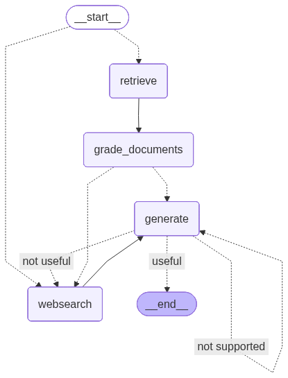

# LangGraph RAG System 🦜🔗

An advanced **Retrieval-Augmented Generation (RAG)** system built with LangGraph, featuring:

* ✅ **Adaptive RAG** — Intelligent routing between vectorstore and web search
* ✅ **Self RAG** — Hallucination detection and answer quality verification
* ✅ **Corrective RAG** — Document relevance evaluation before generation
  


---

## 🚀 Features

### 1️⃣ Intelligent Routing (Adaptive RAG)

The system dynamically decides whether to use the vectorstore or web search based on the user's query.

### 2️⃣ Document Evaluation (Corrective RAG)

Retrieved documents are evaluated for relevance before generating the final answer.

### 3️⃣ Hallucination Detection (Self RAG)

The generated response is checked to ensure it is grounded, relevant, and free from hallucinations.

---

## 📋 Prerequisites

* Python 3.13+
* Poetry (for dependency management)
* OpenAI API Key
* Tavily API Key (for web search)

---

## ⚙️ Installation & Setup

### 1️⃣ Clone the Repository

```bash
git clone https://github.com/tinars/langgraph-rag-system.git
cd langgraph-rag-system
```

### 2️⃣ Install Dependencies

```bash
poetry install
```

### 3️⃣ Configure Environment Variables

Copy the example environment file and add your API keys:

```bash
cp .env.example .env
```

Then edit the `.env` file:

```bash
OPENAI_API_KEY=sk-...
TAVILY_API_KEY=tvly-...
```

### 4️⃣ Run Ingestion (One-time setup)

Load documents into the vector store:

```bash
poetry run python ingestion.py
```

### 5️⃣ Run the Application

```bash
poetry run python main.py
```

---

## 🏗️ Project Structure

```
langgraph-rag-system/
├── graph/
│   ├── chains/          # LLM chains (grading, generation, etc.)
│   ├── nodes/           # Graph nodes (retrieve, generate, web_search, etc.)
│   ├── state.py         # State definition
│   ├── consts.py        # Constants
│   └── graph.py         # Main graph construction
├── ingestion.py         # Vector store ingestion
├── main.py              # Entry point
├── graph.png            # Graph visualization
├── pyproject.toml       # Poetry configuration
└── README.md            # This file
```

---

## 🧪 Running Tests

```bash
poetry run pytest -v
```

---

## 📊 System Workflow

```
User Question
    ↓
Router (Vectorstore or Web Search?)
    ↓
┌───────────┴───────────┐
│                       │
Vectorstore         Web Search
    ↓                   ↓
Grade Documents         │
    ↓                   │
┌───┴───┐               │
│       │               │
Relevant  Not Relevant ─┘
│           │
Generate    Web Search → Generate
    ↓
Check Hallucination
    ↓
Check Relevance to Question
    ↓
Final Answer ✅
```

---

## 🛠️ Technologies Used

* LangChain — Core LLM framework
* LangGraph — Graph-based workflow orchestration
* OpenAI GPT-4 — Language model
* Chroma — Vector database
* Tavily — Web search API
* HuggingFace Embeddings — Text-to-vector embedding model

---

## 📝 License

MIT License — Free to use and modify.

---

## 🤝 Contributing

Pull requests and issues are welcome!

---

## ⚠️ Note

This project was created during the course "LangGraph – Develop LLM-powered agents with LangGraph" by Eden Marco.  
The main purpose of this project is personal learning and practice.  

---
## 📧 Contact

* GitHub: [@tinars](https://github.com/tinars)
* Email: [tinarostami110@gmail.com](mailto:tinarostami110@gmail.com)

---

**By Tina Rostami**
